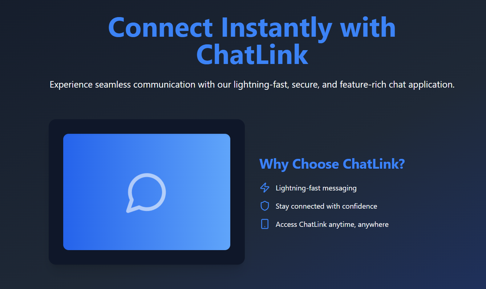

#  ChatLink

**ChatLink** is a sleek, real-time messaging web app featuring customizable profiles and secure authentication. Built with Node.js, Express, Socket.io, and PostgreSQL on the backend, and a responsive React frontend with TypeScript.

[](https://github.com/rahul4019/ChatLink/actions/workflows/deploy-to-ec2.yml)

🌐 **Live Demo**: [chatlink.my.to](http://chatlink.uk.to)



---

## 📑 Table of Contents

1. [✨ Features](#-features)
2. [🛠️ Tech Stack](#️-tech-stack)
3. [🚀 How to Run ChatLink Locally](#-how-to-run-chatlink-locally)
4. [🎉 Contribute](#-contribute)

---

## ✨ Features

### 1. **User Authentication & Profiles** 👤

- **Registration** via email 📧 and **JWT** login 🔑.
- **Search users** by email or username 🔍.
- **Profile Information**: Name, email, username, bio, and profile picture 📸.
- **Profile Picture**: Upload, update, and validate image size/type 🖼️.
- **Activity Status**: Online/offline display🌐.
- **Profile Updates**: Edit details like username, email with validation ✏️.

---

### 2. **Messaging Features & Read Receipts** 💬

- **One-on-One Messaging**: Real-time text messaging with timestamps ⏰.
- **Typing Indicators**: Notify when a user is typing ⌨️.
- **Message Status**: Delivery status (sent, delivered, read) with optional read receipts ✅.

---

### 3. **Real-Time Communication** ⚡

- Live **messaging** using **Socket.IO** ⚡.
- Instant updates for message delivery, read status, and typing indicators 📲.
- **Live presence status** (online/offline) 🟢🔴.

---

## 🛠️ Tech Stack

ChatLink is powered by a modern, scalable, and developer-friendly tech stack! Here's what makes it awesome:

### 🌐 **Frontend**

- **React**: For building dynamic and responsive user interfaces.
- **Redux Toolkit**: For state management of the app.
- **Shadcn**: For styled components and elegant UI.
- **Tailwind CSS**: For fast and flexible styling.

### ⚙️ **Backend**

- **Node.js**: A robust runtime for building the server.
- **Express.js**: To create a seamless API for communication.
- **Socket.io**: Enabling real-time chat functionality.

### 🗄️ **Database**

- **PostgreSQL**: A powerful relational database for secure data storage.
- **Supabase**: For real-time updates and simplified database management.

### ✅ **Validation**

- **Zod**: Ensures reliable and clean data validation.

### ☁️ **Cloud Services**

- **AWS EC2**: To host the backend for reliable performance.
- **AWS S3**: To store profile pictures and other user-uploaded content.

### ♾️ **DevOps**

- **AWS**: Cloud computing services, including EC2 and S3 for hosting and storage.
- **GitHub Actions**: CI/CD automation for continuous integration and deployment pipelines.
- **Docker**: Containerization for consistent environments across development, testing, and production.

### 🧑‍💻 **Programming Language**

- **TypeScript**: Ensuring type safety and maintainability throughout the project.

---

## 🚀 How to Run ChatLink Locally

Follow these simple steps to set up ChatLink on your local environment.

---

### 🖥️ Prerequisites

Before starting, make sure you have the following installed:

- [Node.js](https://nodejs.org/) (LTS version recommended)
- A working PostgreSQL database (for the backend).

---

### 📝 Steps to Get Started

1. **Clone the Project**  
   Open your terminal and run the following commands:

   ```bash
   git clone https://github.com/rahul4019/Chatlink.git
   cd chatlink
   ```

2. **Set Up Environment Files**

    - Inside the root directory, you will see two folders: api and client.
    - Navigate to the api folder:
        ```bash
        cd api
        ```
    
        Create a .env file by copying the content from .env-example:
        ```bash
        cp .env-example .env
        ```

    - Navigate to the client folder:
        ```bash
        cd ../client
        ```

        Create a .env file here too by copying the content from .env-example:
        ```bash
        cp .env-example .env
        ```

3. **Run the API and Client**

    - First, navigate to the api directory to start the backend server:
        ```bash
        cd api
        npm install
        npm run dev
        ```

    - Open a new terminal window, navigate to the client directory, and start the frontend:
        ```bash
        cd client
        npm install
        npm run dev
        ```

4. **Open the Application**

    - Once both the API and client are running, open your browser and go to: http://localhost:5173
    - You should now see the ChatLink web app! 🎉

## 🎉 Contribute

We welcome contributions to ChatLink! Here's how you can get involved:

1. **Fork and clone the repository**:  
   Fork this repo and clone it to your local machine to start working.

2. **Create a new branch**:  
   Create a branch for your changes (e.g., `feature-add-chat-notifications`).

3. **Submit a Pull Request**:  
   After making your changes, push your branch and create a Pull Request to the main repository.

---

### 🤝 Need Help?

💡 If you get stuck, feel free to reach out!

- Open an issue for help or tag me (@rahul4019) in your PR.
- You can also contact me at [rahuldevstack@gmail.com](mailto:rahuldevstack@gmail.com).

Let's make ChatLink even better together! 🚀
